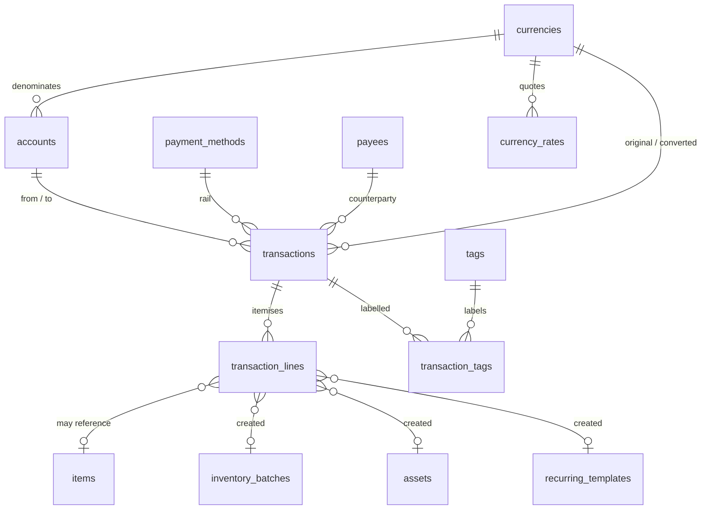
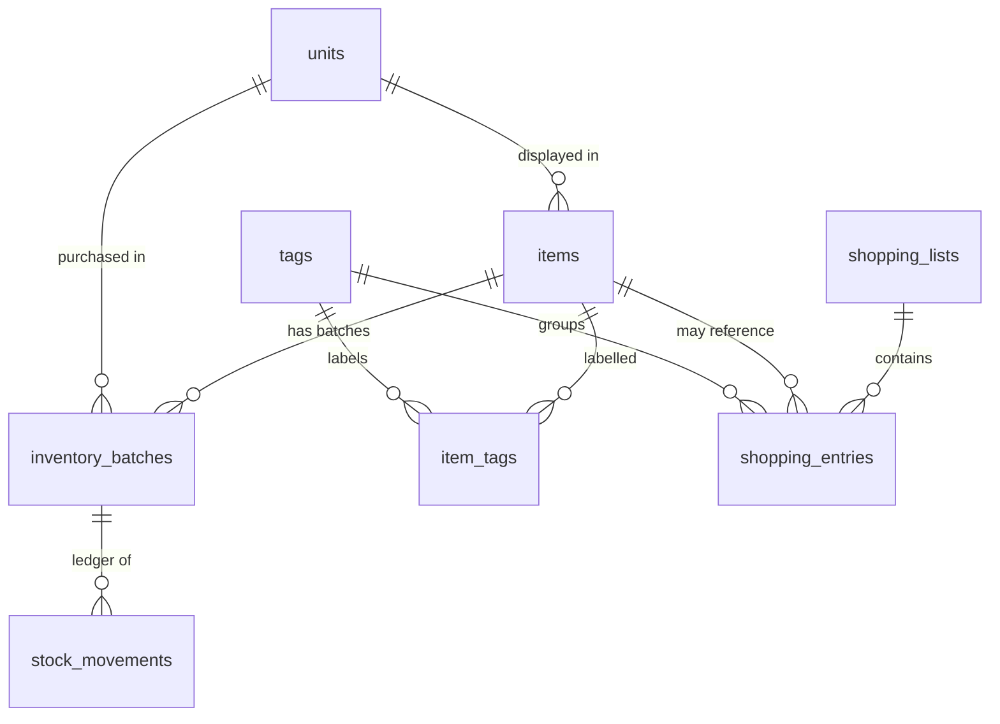
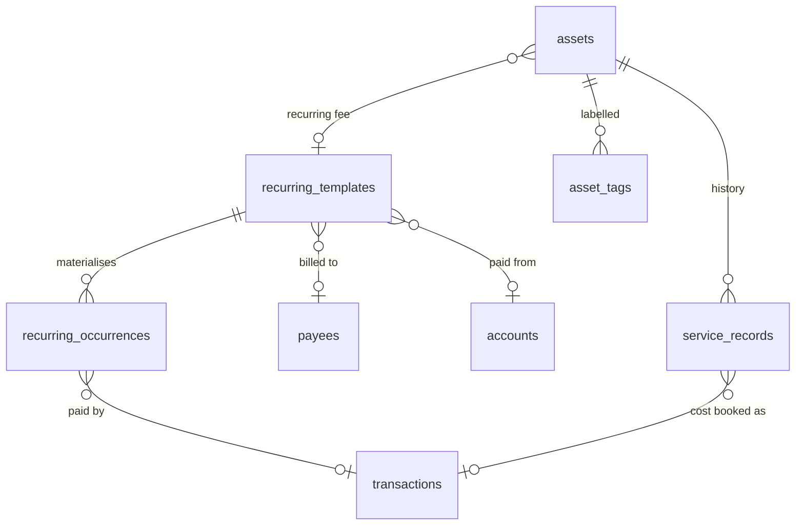

# Alaya · ARCH 2 — Database

**31 tables · 11 views · 2 FTS tables.** Attach with ARCH_1 for phases 1B, 1C, 2x, 3x.

Terminology and value objects are defined in ARCH_1 §3–§5. Read the Laws (ARCH_1 §2) first.

---

## 1. Entity relationships

Three diagrams for legibility.

### 1.1 Money



### 1.2 Inventory & shopping



### 1.3 Recurring & service



---

## 1.x Reading a nullable money column

`MoneyColumns.readNullable(minor, currencyCode)` enforces a pairing invariant — both null, or both
present, else it throws `ArgumentError: Half-populated money pair`. That is correct **only where the
currency is a nullable column written and cleared alongside its own amount**:
`inventory_batches.cost_currency_code`, `service_records.currency_code`.

It is wrong in two shapes, and both throw on perfectly ordinary rows:

| Shape | Example | Why it breaks |
|---|---|---|
| Currency always present | `transaction_lines.unit_price_minor` against the parent transaction's `original_currency_code`; `shopping_entries.estimated_price_minor` against the home currency from settings | The currency can never be null, so a null amount is a legitimate absence rather than a broken pair |
| One currency, two amounts | `assets.purchase_currency_code` serving both `purchase_price_minor` and `disposal_amount_minor` | Either amount may be null while the other is set, in both directions |

In both shapes, guard the amount instead:

```dart
amount == null ? null : Money(amount!, currencyCode)
```

**Test rule.** Every mapper reading a nullable money column needs one case with the amount null and
the currency present. Six occurrences of this shipped; all six passed unit tests that only exercised
the populated row, and two would first have failed in Phase 6D and 6E.

**Foreign keys take no sentinel default.** `inventory_batches.unit_code_at_purchase` references
`units(code)`, and `line.unitCode ?? ''` turned a missing value into `FOREIGN KEY constraint failed`
several layers away, after the transaction had already committed. A missing foreign key value is
refused where it is missing, never defaulted to an empty string.

## 1.y `occurredAt` on a transaction another module created

The ledger orders by `date_key DESC, occurred_at DESC`. A hand-entered expense stamps `occurredAt` from
the clock; two repositories stamped `dateKey.toUtcMidnight()` instead, which sent **every same-day entry
to the bottom of that day's group** — behind everything typed by hand, in an order with no relationship
to anything the user did. `ServiceRecordRepository.save` and `RecurringRepository.payOccurrence` both had
it, independently, because nothing said which to use.

> **A transaction created today stamps `occurredAt` from the clock. Only a back-dated one may use
> midnight.**

```dart
occurredAtUtc: dateKey == _clock.today() ? _clock.now().toUtc() : dateKey.toUtcMidnight(),
```

Midnight is right for a back-dated record and wrong for a fresh one: nobody knows what time last
Tuesday's plumber came, and inventing a time would be a worse lie than admitting the day is all we have.
`createdAt` is not a substitute — it records when the row was written, which is a different question the
ledger deliberately does not ask.

## 2. Common columns

Present on **every** table below unless stated otherwise, and omitted from the column lists
to keep them readable:

```
id         TEXT    PRIMARY KEY   -- UUIDv7, generated in Dart (L5)
createdAt  INTEGER NOT NULL      -- epoch millis UTC (L4)
updatedAt  INTEGER NOT NULL      -- epoch millis UTC
deletedAt  INTEGER               -- NULL = active (L6)
```

Two exceptions: `stock_movements` has **no** `deletedAt` (§5.3), and `app_settings`,
`currencies`, `units`, `analytics_cache` use natural text keys instead of UUIDs.

Foreign keys are declared with `references()`. **No `ON DELETE CASCADE`** anywhere — soft
delete is an application concern and cascading hard deletes would defeat it.

---

## 3. Meta & reference

| Table | Purpose | Columns |
|---|---|---|
| `app_settings` | One key/value store for everything user-configurable. | `key TEXT PK`, `value TEXT`, `valueType` |
| `currencies` | Supported currencies, extensible with no migration. | `code TEXT PK`, `name`, `symbol`, `decimalDigits`, `isEnabled`, `sortOrder` |
| `currency_rates` | Daily rate cache, single pivot base. | `baseCode`, `quoteCode`, `rateDateKey`, `rate REAL`, `rateRaw TEXT`, `source`, `fetchedAt` |
| `units` | System + user-defined units, integer factor to category base. | `code TEXT PK`, `category`, `factorToBaseMilli INTEGER`, `displayName`, `isSystem`, `sortOrder` |
| `tags` | The single tag table, scoped per module. | `name`, `normalizedName`, `colorArgb`, `iconKey`, `parentTagId`, `allowedInDeposit`, `allowedInWithdrawal`, `allowedInInventory`, `allowedInShopping`, `allowedInRecurring`, `allowedInService`, `isSystem`, `sortOrder` |
| `attachments` | Receipt / warranty photos. Table now, UI in Phase 8B — this avoids a later migration. | `ownerType`, `ownerId`, `relativePath`, `mimeType`, `sizeBytes` |

`tags.parentTagId` allows exactly **one** level of nesting (`Grocery > Vegetables`), depth
enforced in the repository. That single column is what makes drill-down analytics possible.

`decimalDigits` is why nothing hardcodes `100`: JPY is 0, the rest are 2.

---

## 4. Money

| Table | Columns |
|---|---|
| `accounts` | `name`, `normalizedName`, `kind ∈ {cash,bank,wallet,card,other}`, `currencyCode → currencies`, `openingBalanceMinor`, `openingBalanceDateKey`, `colorArgb`, `iconKey`, `isArchived`, `includeInNetWorth`, `sortOrder` |
| `payment_methods` | `name`, `kind ∈ {cash,upi,bankTransfer,card,cheque,wallet,other}`, `isSystem`, `sortOrder` |
| `payees` | `name`, `normalizedName`, `kind ∈ {person,merchant,employer,utility,other}`, `phone`, `note` |
| `transaction_tags` | `transactionId`, `tagId` · composite PK, no UUID, no soft delete |

### 4.1 `transactions`

```
kind                   TEXT    NOT NULL  -- deposit | withdrawal | transfer
                                         -- | adjustmentIncrease | adjustmentDecrease
subtype                TEXT    NOT NULL  -- grocery | household | electronics | bill
                                         -- | transferSelf | transferOut | salaryIn
                                         -- | otherIn | otherOut
occurredAt             INTEGER NOT NULL  -- epoch millis UTC
dateKey                INTEGER NOT NULL  -- yyyymmdd, local civil date
monthKey               INTEGER NOT NULL  -- yyyymm, denormalised for analytics
originalAmountMinor    INTEGER NOT NULL  -- always > 0; sign comes from `kind`
originalCurrencyCode   TEXT    NOT NULL  -> currencies
fromAccountId          TEXT              -> accounts
toAccountId            TEXT              -> accounts
paymentMethodId        TEXT              -> payment_methods
payeeId                TEXT              -> payees
note                   TEXT
needsReview            INTEGER NOT NULL  -- set by quick-add; drives the "add details" nudge
recurringTemplateId    TEXT              -> recurring_templates
recurringOccurrenceId  TEXT              -> recurring_occurrences
convertedAmountMinor   INTEGER           -- explicit frozen snapshot only (L9)
convertedCurrencyCode  TEXT
conversionRate         REAL
conversionRateRaw      TEXT              -- exact API string, for reproducibility
conversionDateKey      INTEGER
deleteReason           TEXT
```

**Table-level CHECK constraints.** These are the shape guarantees that make
`v_account_ledger` sound. Declare them verbatim in `customConstraints`:

```sql
CHECK (original_amount_minor > 0)

CHECK (
  (kind IN ('deposit','adjustmentIncrease')
     AND to_account_id IS NOT NULL AND from_account_id IS NULL)
  OR
  (kind IN ('withdrawal','adjustmentDecrease')
     AND from_account_id IS NOT NULL AND to_account_id IS NULL)
  OR
  (kind = 'transfer'
     AND from_account_id IS NOT NULL AND to_account_id IS NOT NULL
     AND from_account_id <> to_account_id)
)

CHECK (date_key / 100 = month_key)
```

> **Two notes for whoever writes the UI.** Account is **NOT NULL in the database** but
> **optional in the UI** — quick-add silently uses the last-used account, falling back to the
> default. That is how "optional-first" and correct accounting coexist: optional to the user,
> mandatory to the schema.
>
> A `transfer` is **one row**, not a pair. `v_account_ledger` expands it into two signed legs,
> and a self-transfer therefore nets to zero by construction.

### 4.2 `transaction_lines`

```
transactionId                TEXT    NOT NULL -> transactions
lineNo                       INTEGER NOT NULL
description                  TEXT    NOT NULL
itemId                       TEXT             -> items
quantityMilli                INTEGER          -- Qty base x 1000 (L2)
unitCode                     TEXT             -> units
unitPriceMinor               INTEGER
lineAmountMinor              INTEGER
destination                  TEXT    NOT NULL  -- none | inventory | asset | recurring
createdBatchId               TEXT             -> inventory_batches
createdAssetId               TEXT             -> assets
createdRecurringTemplateId   TEXT             -> recurring_templates
note                         TEXT
```

`destination` is the single field that removes the electronics/inventory/service ambiguity.
One line produces **at most one** destination artefact, and which one it produced is recorded.

Lines are optional detail; `transactions.originalAmountMinor` is the source of truth. When
they disagree (₹500 total, ₹480 of lines) the difference is surfaced as an "unallocated ₹20"
chip via `v_transaction_allocation`. Never auto-balanced, never forced equal.

---

## 5. Inventory

### 5.1 `items`

```
name                     TEXT    NOT NULL
normalizedName           TEXT    NOT NULL
unitCategory             TEXT    NOT NULL  -- weight | volume | count  ** IMMUTABLE (L8) **
defaultDisplayUnitCode   TEXT    NOT NULL -> units
itemKind                 TEXT    NOT NULL  -- generic | food | medicine | beauty
                                           -- | household | other
lowStockThresholdMilli   INTEGER
expiryNotifyDays         INTEGER
notes                    TEXT
isFavorite               INTEGER NOT NULL
```

Identity is `(normalizedName, unitCategory)`, enforced by a **partial unique index**. Same
category → same Item, new Batch. Different category → different Item, disambiguated in the UI
as `Milk (Volume)` / `Milk (Weight)`.

`itemKind = medicine` is what makes "medicine expiry" work on the calendar with no extra table.

### 5.2 `inventory_batches`

```
itemId                    TEXT    NOT NULL -> items
initialQuantityMilli      INTEGER NOT NULL
remainingQuantityMilli    INTEGER NOT NULL  -- CACHE (L3) — reconstructible from movements
unitCodeAtPurchase        TEXT    NOT NULL -> units
expiryDateKey             INTEGER
purchasedDateKey          INTEGER NOT NULL
unitCostMinor             INTEGER
costCurrencyCode          TEXT             -> currencies
sourceTransactionLineId   TEXT             -> transaction_lines
origin                    TEXT    NOT NULL  -- purchase | manual | import
                                            -- | adjustment | detached
storageLocation           TEXT
note                      TEXT
```

**`unitCostMinor` is the cost per `unitCodeAtPurchase`, not per base unit.** ₹50 recorded against a
batch whose `unitCodeAtPurchase` is `kg` means ₹50 per kilogram — so valuing the batch requires
`unitCostMinor x (remainingQuantityMilli / units.factor_to_base_milli)`, joining `units` on
`unitCodeAtPurchase`.

Dividing by 1000 instead — treating the cost as per base unit — is right only when the purchase unit
*is* the base unit, and wrong by that unit's whole magnitude otherwise. Phase 4C's analytics did
exactly that and valued a 2 kg batch at ₹100,000 instead of ₹100. The error is dangerous precisely
because it is invisible for gram- and millilitre-denominated purchases and a thousandfold for
kilograms and litres, so a spot check of the wrong row confirms it as correct (ARCH_4 R18).

`origin = detached` is what a batch becomes when its source transaction is deleted — the food
does not un-exist because you deleted the receipt.

### 5.3 `stock_movements` — append-only

```
batchId              TEXT    NOT NULL -> inventory_batches
itemId               TEXT    NOT NULL -> items   -- denormalised for analytics speed
kind                 TEXT    NOT NULL  -- openingIn | purchaseIn | manualIn | consume
                                       -- | waste | expired | adjustIn | adjustOut
quantityMilli        INTEGER NOT NULL  -- always > 0; direction comes from `kind`
occurredAt           INTEGER NOT NULL
dateKey              INTEGER NOT NULL
reason               TEXT
note                 TEXT
linkedTransactionId  TEXT             -> transactions
reversesMovementId   TEXT             -> stock_movements
```

> **Explicit exception to L6: no `deletedAt`.** Corrections insert a *reversing* row pointing
> at the original via `reversesMovementId`. This is deliberate — a ledger you can edit is not
> a ledger. Undo in the UI writes a reversal: the user sees "removed", the data stays
> auditable, and waste analytics stays honest.

`kind = waste | expired` is what powers the food-waste analytics (query 14 in ARCH_3 §5.1),
which is one of the app's genuinely differentiating insights.

---

## 6. Shopping

| Table | Columns |
|---|---|
| `shopping_lists` | `name`, `isDefault`, `isArchived`, `targetDateKey` |
| `shopping_entries` | `listId → shopping_lists`, `itemId`, `freeText`, `quantityMilli`, `unitCode`, `tagId` *(the group header)*, `estimatedPriceMinor`, `isChecked`, `checkedAt`, `origin ∈ {manual,autoLowStock,fromRecurring}`, `autoState ∈ {active,snoozed,dismissed}`, `snoozeUntilDateKey`, `generatedAtStockMilli`, `purchasedTransactionLineId`, `sortOrder` |

`itemId` is nullable so `TV ☐` works without inventing an inventory Item. `tagId` **is** the
group header from the spec example (Grocery / Beauty / Electronics) — no join table needed
here, unlike the other modules.

`origin` + `autoState` + `generatedAtStockMilli` are what make low-stock auto-generation
idempotent and dismissible without the entry reappearing on the next regeneration.

---

## 7. Recurring

### 7.1 `recurring_templates`

```
name                      TEXT    NOT NULL
normalizedName            TEXT    NOT NULL
kind                      TEXT    NOT NULL  -- bill | subscription | rent | salary
                                            -- | serviceFee | other
direction                 TEXT    NOT NULL  -- outflow | inflow
defaultAmountMinor        INTEGER NOT NULL
currencyCode              TEXT    NOT NULL -> currencies
payeeId                   TEXT             -> payees
defaultAccountId          TEXT             -> accounts
defaultPaymentMethodId    TEXT             -> payment_methods
tagId                     TEXT             -> tags
intervalUnit              TEXT    NOT NULL  -- day | week | month | year
intervalCount             INTEGER NOT NULL
anchorDayOfMonth          INTEGER           -- 1..31, CLAMPED at render, never mutated
anchorMonth               INTEGER
anchorWeekday             INTEGER
startDateKey              INTEGER NOT NULL
endDateKey                INTEGER
nextDueDateKey            INTEGER NOT NULL
isPaused                  INTEGER NOT NULL
autoRemind                INTEGER NOT NULL
remindDaysBefore          INTEGER NOT NULL
linkedAssetId             TEXT             -> assets
note                      TEXT
```

`direction = inflow` is what lets salary be a recurring template rather than a second system.

`anchorDayOfMonth` is stored once and **clamped at render** (31 → 28/29/30 as the month
requires). It is never rewritten, so a bill anchored on the 31st stays anchored on the 31st
instead of walking backwards to the 28th forever.

### 7.2 `recurring_occurrences`

```
templateId         TEXT    NOT NULL -> recurring_templates
dueDateKey         INTEGER NOT NULL
status             TEXT    NOT NULL  -- due | paid | skipped | dismissed
paidTransactionId  TEXT             -> transactions
paidAmountMinor    INTEGER           -- the ACTUAL paid amount, may differ from default
paidDateKey        INTEGER
note               TEXT
```

Rows are **materialised lazily** up to today, never in advance and never automatically paid.
A `due` row whose `dueDateKey` is in the past renders as *overdue* — a derived state, not a
stored one. Money is only ever created by an explicit user tap.

---

## 8. Service

### 8.1 `assets`

```
name                        TEXT    NOT NULL
normalizedName              TEXT    NOT NULL
type                        TEXT    NOT NULL  -- appliance | electronics | vehicle
                                              -- | furniture | property | serviceProvider
                                              -- | subscription | other
brand                       TEXT
modelNo                     TEXT
serialNo                    TEXT
purchaseDateKey             INTEGER
purchasePriceMinor          INTEGER
purchaseCurrencyCode        TEXT             -> currencies
sourceTransactionLineId     TEXT             -> transaction_lines
warrantyStartDateKey        INTEGER
warrantyEndDateKey          INTEGER
warrantyProvider            TEXT
warrantyNote                TEXT
serviceIntervalDays         INTEGER
nextServiceDueDateKey       INTEGER
primaryContactName          TEXT
primaryContactPhone         TEXT
location                    TEXT
linkedRecurringTemplateId   TEXT             -> recurring_templates
status                      TEXT    NOT NULL  -- active | underRepair | disposed
disposedAtDateKey           INTEGER
disposalReason              TEXT              -- sold | expired | damaged | gifted
                                              -- | lost | replaced | other
disposalNote                TEXT
disposalAmountMinor         INTEGER
notes                       TEXT
```

`type = serviceProvider` is how a house maid lives in the same table as a TV: an Asset, plus
a linked `recurring_template` for monthly salary, plus a `service_records` row per payment.
No second system.

`disposalReason` + `status = disposed` implement "delete my TV by selecting a reason" as a
**status change, not a delete**, so the ₹45,000 you spent on it stays in your analytics.

### 8.2 `service_records` and `asset_tags`

| Table | Columns |
|---|---|
| `service_records` | `assetId → assets`, `serviceDateKey`, `type ∈ {service,repair,maintenance,inspection,salaryPaid,other}`, `providerName`, `providerPhone`, `costMinor`, `currencyCode`, `linkedTransactionId`, `nextDueDateKey`, `notes` |
| `asset_tags` | `assetId`, `tagId` · composite PK |
| `item_tags` | `itemId`, `tagId` · composite PK |

---

## 9. Ops

| Table | Columns |
|---|---|
| `notification_schedule` | `kind ∈ {expiry,serviceDue,recurringDue,lowStock,warrantyEnd}`, `refType`, `refId`, `scheduledAtUtcMillis`, `androidNotificationId INTEGER`, `status ∈ {scheduled,fired,cancelled}` |
| `backup_history` | `filePath`, `sizeBytes`, `schemaVersion`, `appVersion`, `kind ∈ {manual,auto}`, `recordCountsJson`, `note` |
| `analytics_cache` | `cacheKey TEXT PK`, `paramsHash`, `payloadJson`, `computedAt`, `staleAfter` |

`notification_schedule` exists so every Android notification has a stable ID that can be
cancelled when the underlying record changes — without it you get orphaned notifications for
items you already ate.

`analytics_cache` is defined now and used in Phase 7B. Defining it now avoids a migration.

---

## 10. FTS

| Table | Kind |
|---|---|
| `items_fts` | FTS5 virtual, external content on `items(name, notes)` + 3 sync triggers |
| `transactions_fts` | FTS5 virtual, external content on `transactions(note)` + 3 sync triggers |

External content means the FTS index stores no duplicate data; the triggers
(`AFTER INSERT`, `AFTER UPDATE`, `AFTER DELETE`) keep it aligned. This cannot be bolted on
cheaply later, which is why it is Phase 1C and not Phase 7.

Verify FTS5 is compiled in: assert `PRAGMA compile_options` contains `ENABLE_FTS5` in the
debug `beforeOpen`.

---

## 11. Indexes

Declared as **raw SQL** in `indexes.drift`, because partial `WHERE` clauses are only reliably
expressible there — not through Dart annotations.

```sql
-- ── identity / uniqueness (all partial: soft delete must not block re-adding a name)
CREATE UNIQUE INDEX idx_items_identity
  ON items(normalized_name, unit_category)          WHERE deleted_at IS NULL;
CREATE UNIQUE INDEX idx_accounts_name
  ON accounts(normalized_name)                      WHERE deleted_at IS NULL;
CREATE UNIQUE INDEX idx_tags_name
  ON tags(normalized_name)                          WHERE deleted_at IS NULL;
CREATE UNIQUE INDEX idx_payees_name
  ON payees(normalized_name)                        WHERE deleted_at IS NULL;
CREATE UNIQUE INDEX idx_shopping_auto
  ON shopping_entries(list_id, item_id)
  WHERE origin = 'autoLowStock' AND deleted_at IS NULL;
CREATE UNIQUE INDEX idx_recurring_occ
  ON recurring_occurrences(template_id, due_date_key) WHERE deleted_at IS NULL;
CREATE UNIQUE INDEX idx_rates_point
  ON currency_rates(base_code, quote_code, rate_date_key);

-- ── read paths
CREATE INDEX idx_tx_date        ON transactions(date_key)             WHERE deleted_at IS NULL;
CREATE INDEX idx_tx_month_kind  ON transactions(month_key, kind)      WHERE deleted_at IS NULL;
CREATE INDEX idx_tx_from        ON transactions(from_account_id, date_key);
CREATE INDEX idx_tx_to          ON transactions(to_account_id, date_key);
CREATE INDEX idx_tx_subtype     ON transactions(subtype, month_key);
CREATE INDEX idx_tx_recurring   ON transactions(recurring_template_id);
CREATE INDEX idx_lines_item     ON transaction_lines(item_id);
CREATE INDEX idx_lines_tx       ON transaction_lines(transaction_id);
CREATE INDEX idx_batch_item     ON inventory_batches(item_id)         WHERE deleted_at IS NULL;
CREATE INDEX idx_batch_expiry   ON inventory_batches(expiry_date_key) WHERE deleted_at IS NULL;
CREATE INDEX idx_move_batch     ON stock_movements(batch_id);
CREATE INDEX idx_move_item_date ON stock_movements(item_id, date_key);
CREATE INDEX idx_occ_due        ON recurring_occurrences(due_date_key, status);
CREATE INDEX idx_asset_service  ON assets(next_service_due_date_key)  WHERE deleted_at IS NULL;
CREATE INDEX idx_asset_warranty ON assets(warranty_end_date_key)      WHERE deleted_at IS NULL;
```

### 11.1 A partial index cannot be an `ON CONFLICT` target

**Six of the seven unique indexes above are partial**, and SQLite will not accept a partial index as
an upsert conflict target unless its `WHERE` predicate is repeated inside the target clause:

```sql
-- Fails to compile: "ON CONFLICT clause does not match any PRIMARY KEY or UNIQUE constraint"
INSERT INTO recurring_occurrences ... ON CONFLICT(template_id, due_date_key) DO UPDATE ...

-- Accepted, but drift's DoUpdate.target takes a List<Column> with nowhere to put the predicate
INSERT ... ON CONFLICT(template_id, due_date_key) WHERE deleted_at IS NULL DO UPDATE ...
```

So **no drift upsert can dedupe against any of these six.** Worse, the failure is not a compile
error: `insertOnConflictUpdate` defaults its target to the *primary key*, which for a UUID PK is a
fresh value that never conflicts — so the row inserts and only then trips the unique index at
runtime.

This was found in Phase 2C and had already shipped two crashes in Phase 2A and 2B code, both on
ordinary user actions: the second currency-rate fetch of any given day, and the second low-stock
regeneration. Verified against SQLite.

| Index | Partial? | How to upsert against it |
|---|---|---|
| `idx_rates_point` | no | name the target explicitly: `target: [baseCode, quoteCode, rateDateKey]` |
| the other six | **yes** | read-then-write inside one `transaction {}` |

`InsertMode.insertOrIgnore` also avoids the crash and is the wrong tool: it swallows *every*
constraint violation, so a bad foreign key silently writes nothing instead of surfacing.

---

## 12. Views — the read model

Repositories read these, never base tables (L7). Written as SQL in `.drift` files so drift
generates typed row classes.

| View | Answers | Dart row class |
|---|---|---|
| `v_account_ledger` | Every transaction expanded into signed per-account legs. **The keystone.** | `AccountLedgerRow` |
| `v_account_balances` | `openingBalance + Σ legs` per account, in the account's own currency | `AccountBalanceRow` |
| `v_active_transactions` | `transactions` where `deletedAt IS NULL`, joined to account / payee / method names | `ActiveTransactionRow` |
| `v_transaction_allocation` | Per transaction: `amountMinor`, `Σ lineAmountMinor`, `unallocatedMinor` | `TransactionAllocationRow` |
| `v_monthly_totals` | `(monthKey, kind, currencyCode) → sumMinor, txCount` | `MonthlyTotalRow` |
| `v_item_stock` | Per item: `totalRemainingMilli`, `batchCount`, `nearestExpiryDateKey`, `isLowStock` | `ItemStockRow` |
| `v_batch_stock_check` | Per batch: cached remaining vs `Σ` movements — the reconciliation probe for L3 | `BatchStockCheckRow` |
| `v_low_stock` | Items below threshold with the shortfall, for the suggestion engine | `LowStockRow` |
| `v_recurring_due` | Templates + next occurrence. No stored overdue flag — see §12.2 | `RecurringDueRow` |
| `v_asset_alerts` | Warranty ending / service due within N days | `AssetAlertRow` |
| `v_calendar_events` | The heterogeneous `UNION ALL` feed (ARCH_3 §6) | `CalendarEventRow` |

**Every view declaration carries an explicit row class name** — `CREATE VIEW v_account_balances
AS AccountBalanceRow AS SELECT ...` — rather than drift's derived default (view name + `Data`).
Chosen deliberately in Phase 2A once nine DAOs needed to reference these names with certainty;
retrofitted into the Phase 1C `.drift` files listed above, which are now the authoritative
version. Follows Phase 1B's `XxxRow` convention for table row classes.

### 12.1 The two that carry the correctness

Write these exactly. There is no Dart code path that can get "Total Available Funds" wrong if
these are right.

```sql
CREATE VIEW v_account_ledger AS
  SELECT id AS tx_id, to_account_id   AS account_id,
         original_amount_minor        AS signed_minor,
         original_currency_code AS currency_code, date_key, kind
    FROM transactions
   WHERE deleted_at IS NULL AND kind IN ('deposit','adjustmentIncrease')
  UNION ALL
  SELECT id, from_account_id, -original_amount_minor,
         original_currency_code, date_key, kind
    FROM transactions
   WHERE deleted_at IS NULL AND kind IN ('withdrawal','adjustmentDecrease')
  UNION ALL
  SELECT id, from_account_id, -original_amount_minor,
         original_currency_code, date_key, kind
    FROM transactions
   WHERE deleted_at IS NULL AND kind = 'transfer'
  UNION ALL
  SELECT id, to_account_id,   original_amount_minor,
         original_currency_code, date_key, kind
    FROM transactions
   WHERE deleted_at IS NULL AND kind = 'transfer';

CREATE VIEW v_account_balances AS
  SELECT a.id            AS account_id,
         a.currency_code AS currency_code,
         a.opening_balance_minor
           + COALESCE((SELECT SUM(l.signed_minor)
                         FROM v_account_ledger l
                        WHERE l.account_id = a.id), 0) AS balance_minor
    FROM accounts a
   WHERE a.deleted_at IS NULL;
```

A `transfer` appears twice with opposite signs, so it nets to zero across the two accounts
automatically. That single property is why "Total Available Funds" cannot drift.

### 12.2 No view references the current time

Not `strftime('now')`, not `date('now')`, nowhere in any of the eleven views. Two places read as
if they should: `v_recurring_due` has no `overdue` column despite ARCH_2's original description of
one, and `v_calendar_events`'s `severity` is a static per-type baseline rather than one that
escalates within 7 days as ARCH_3 §6 describes.

Both computations happen in Dart instead, using the injected `Clock` (ARCH_1 §4.3) — the recurring
engine compares `occurrenceDueDateKey` against `clock.today()`, and the calendar aggregator applies
the day-count escalation when it reads `v_calendar_events`. Two reasons this is the schema's job to
refuse: `strftime('now','localtime')` ties a civil date's meaning to the querying process's
timezone, which Law L4 exists to prevent; and a view containing `now` cannot be asserted against a
`FixedClock`, so every calendar and recurring test would need to tolerate the real wall clock or
run non-deterministically. Confirmed in Phase 1C: `pragma_table_info('v_recurring_due')` has 18
columns and no `is_overdue`.

---

## 13. Migrations

- `schemaVersion = 1` at launch.
- `MigrationStrategy` with `stepByStep`, `beforeOpen` running `PRAGMA foreign_keys = ON`
  plus a debug-only `ENABLE_FTS5` assertion.
- **Commit a schema snapshot at v1** (`drift_dev schema dump`). Without a v1 snapshot,
  step-by-step migrations are impossible later. This is a five-minute task that is
  unrecoverable if skipped.
- A v1→v1 migration test must pass before you need it, to prove the harness works.

---

## 14. Seed data

Phase 1C `seed_data.dart` inserts:

- **Currencies** — INR, USD, EUR, JPY, CNY with correct `decimalDigits`.
- **Units** — `g, kg, mg` (weight); `ml, l` (volume); `pc, dozen, pack` (count), with integer
  `factorToBaseMilli`.
- **Payment methods** — Cash, UPI, Bank Transfer, Card, Cheque.
- **Accounts** — `Cash` and `Bank`, both in the device-locale currency, opening balance 0,
  one marked default.
- **Shopping list** — one, `isDefault = true`.
- **System tags** with correct `allowedIn*` scoping. Get this matrix right; it is
  user-visible on first launch.

| Tag | Dep | Wdr | Inv | Shop | Rec | Svc |
|---|---|---|---|---|---|---|
| Salary | ✓ | | | | ✓ | |
| Gift | ✓ | ✓ | | | | |
| Refund | ✓ | | | | | |
| Business | ✓ | ✓ | | | | |
| Grocery | | ✓ | ✓ | ✓ | | |
| Vegetables *(child of Grocery)* | | ✓ | ✓ | ✓ | | |
| Household | | ✓ | ✓ | ✓ | | |
| Kitchen | | | ✓ | ✓ | | |
| Beauty | | ✓ | ✓ | ✓ | | |
| Medicine | | ✓ | ✓ | ✓ | | |
| Electronics | | ✓ | ✓ | ✓ | | ✓ |
| Utilities | | ✓ | | | ✓ | ✓ |
| Rent | | ✓ | | | ✓ | |
| Subscription | | ✓ | | | ✓ | ✓ |
| Transport | | ✓ | | | ✓ | |
| Health | | ✓ | | | ✓ | ✓ |
| Education | | ✓ | | | ✓ | |
| Maintenance | | ✓ | | | ✓ | ✓ |

The `Kitchen` row is the spec's own test case: created for shopping and inventory, it must
**not** appear in the deposit tag picker.

---

## Phase 8A / 8B amendment — no schema change was made either

Three tables sat unread from 1B until 8B, which was deliberate (§3's note that adding attachments later is
not a migration) and is now resolved:

| Table | Reader since 8B |
|---|---|
| `attachments` | `AttachmentStore` behind `AttachmentPort`. `ownerType` is the schema's one polymorphic pointer, and integrity is enforced by the `AttachmentOwner` enum rather than a foreign key — a typo cannot reach the column, and an eighth owner fails to compile at every switch. `relativePath` is relative **because an absolute path breaks the moment a backup is restored onto another device** |
| `notification_schedule` | `LocalNotificationScheduler` behind `ReminderPort`. The digest uses a constant `androidNotificationId`, so `replaceForRef` makes the daily job idempotent. **The table has no `title` and no `scheduledDateKey`** — a screen wanting either derives it, which also keeps English out of a row (Law U5) |
| `backup_history` | Read through `DataTransferPort.watchHistory`. It stores `filePath` and `kind`, **not** `fileName` or `isZipped`; the display name is derived from the path |

**The only hard delete in the codebase is `TrashAdapter._hardDelete`** (ARCH_3 §4.2). It runs under
`PRAGMA defer_foreign_keys`, because **SQLite silently ignores a change to `foreign_keys` inside a
transaction** — the usual disable/delete/re-enable recipe leaves enforcement on and fails on the first child
row. `EraseService` uses the same pragma for the same reason.

`open_database.dart` gained `alayaDatabaseFile()` in 8B, because Replace-mode restore has to move the live
file and nothing exposed its path. **It opens nothing**, so Law L10's single-open-path rule is intact — use
it rather than deriving the path a second time.

---

## Phase 7A amendment — no schema change was made

7A added no table, no column, no view and no migration. Two changes were considered and rejected:

**`kind` on the transaction arm of `v_calendar_events`**, so span totals could split deposits from
withdrawals. Rejected: `TransactionRepository.watchByDateRange` already provides the rows, and a view change
means a schema version bump and a migration for numbers already reachable.

**An eighth `UNION ALL` arm over `recurring_templates`**, so future dues would appear without
materialisation. Rejected: it duplicates recurrence arithmetic the engine already owns, and the real gap was
that `materialiseUpTo` had only ever been called with `clock.today()`.

**Two things about `DateKey` worth recording here**, since both produced runtime throws against valid-looking
input. `DateKey.fromYmd` **validates** — month must be 1–12 and the result must be a real date — where
`DateTime.utc` **normalises**. So `fromYmd(y, 13, 1)` throws while `DateTime.utc(y, 13, 1)` rolls into
January, and `fromYmd(2030, 2, 29)` throws because that date does not exist. Month arithmetic must be done in
absolute months, and "the same day N years on" must use `addDays`. See ARCH_6 P20.

**The `parent_ref_id` gap remains open.** `v_calendar_events` carries `ref_type` and `ref_id` but not the
parent id that three of the six detail routes need. See ARCH_4 §6.3.
